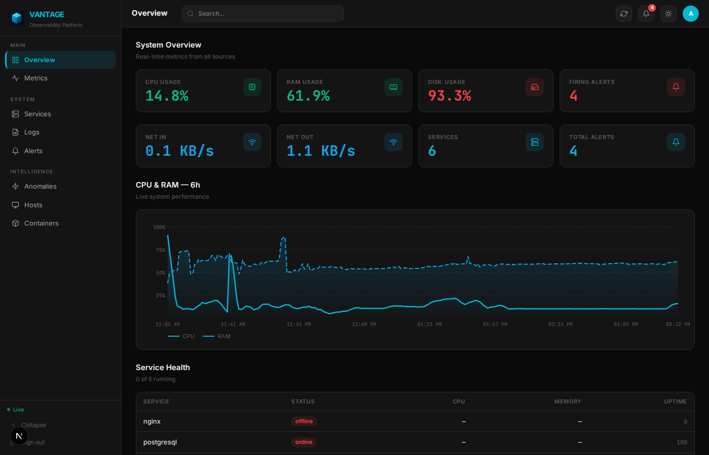
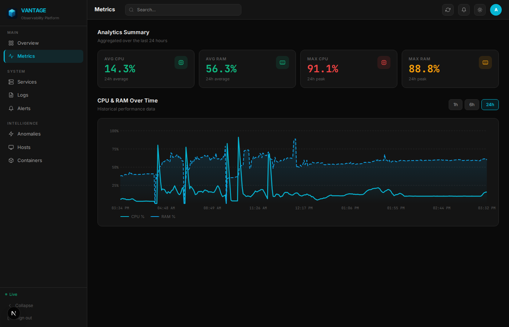
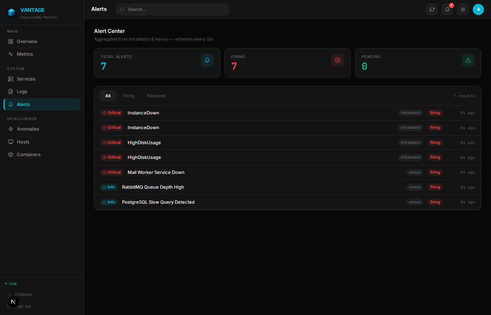
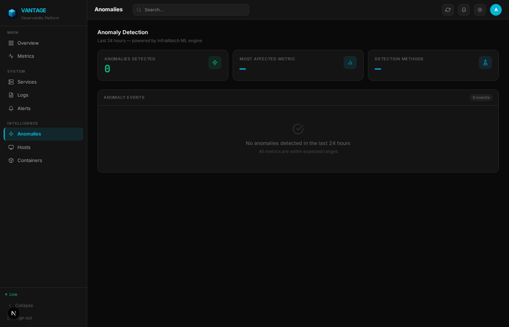
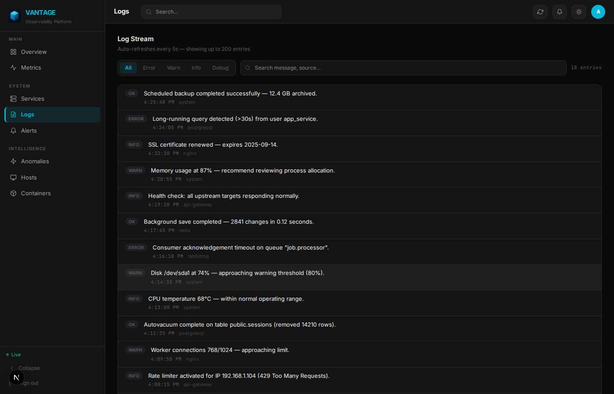
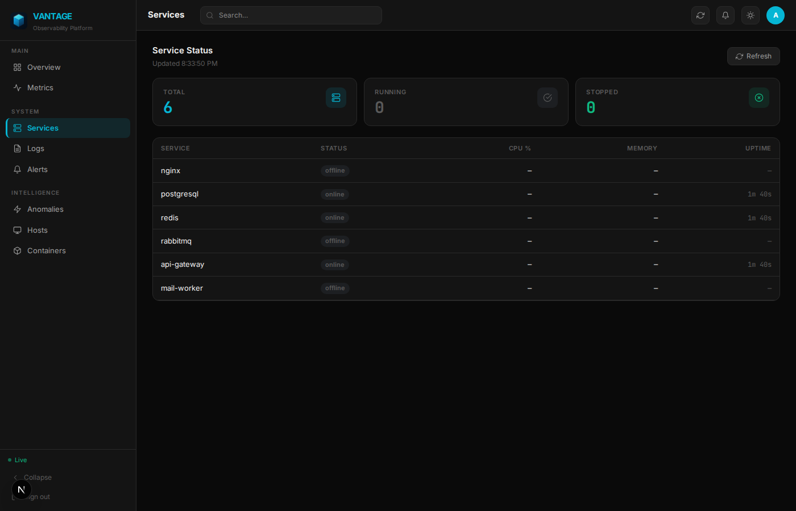
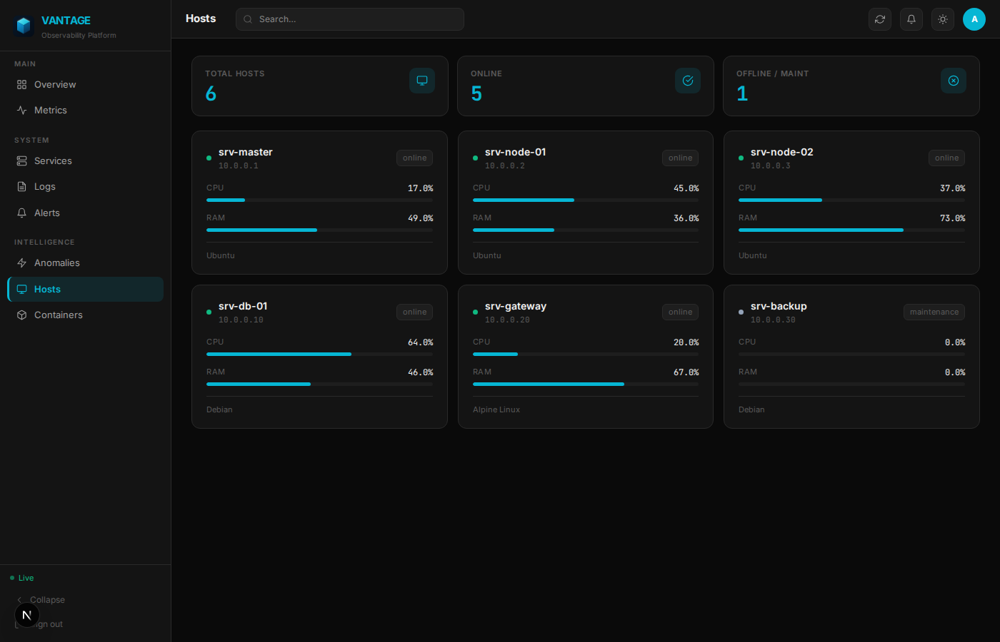
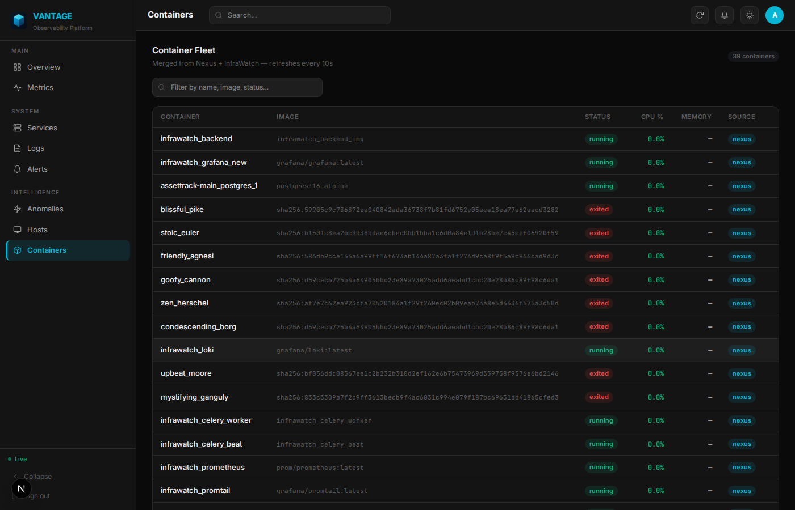

# Vantage

[](https://github.com/vantage-oss/vantage/actions/workflows/ci.yml)
[](LICENSE)
[](https://nextjs.org)
[](https://www.typescriptlang.org)
[](https://www.python.org)

**Open-source observability platform — real-time metrics, logs, alerts, and ML anomaly detection in one unified dashboard.**



--- 

## Screenshots

| Overview | Metrics |
|----------|---------|
|  |  |

| Alerts | Anomalies |
|--------|-----------|
|  |  |

| Logs | Services |
|------|----------|
|  |  |

| Hosts | Containers |
|-------|------------|
|  |  |

---

## Features

| Infrastructure Monitoring | ML & Intelligence |
|---------------------------|-------------------|
| Real-time CPU, RAM, disk & network metrics | Isolation Forest anomaly detection |
| Container & host health tracking | Configurable alert thresholds with auto-resolve |
| Service health overview | Anomaly history and scoring |
| Log streaming with level filtering | Trend analysis across time-series data |
| Multi-source alerts (firing / resolved / acknowledged) | Celery-powered async inference tasks |
| Prometheus & Grafana integration | Redis-backed job queue |

---

## Tech Stack

| Layer | Technologies |
|-------|-------------|
| **Frontend** | Next.js 15, TypeScript, Tailwind CSS, Recharts, Lucide |
| **Nexus API** | Node.js, Express, WebSocket, JWT auth |
| **InfraWatch** | FastAPI, Celery, PostgreSQL, Redis, scikit-learn |
| **Infrastructure** | Prometheus, Grafana, Loki, cAdvisor, Docker Compose |

---

## Architecture

```
┌─────────────────────────────────────────────────────┐
│                    Browser / Client                  │
│              Next.js 15 — localhost:3000             │
└───────────┬──────────────────────────────┬──────────┘
            │ REST / WebSocket             │ REST
            ▼                             ▼
┌───────────────────┐          ┌──────────────────────┐
│    Nexus API      │          │   InfraWatch API      │
│  Node / Express   │          │  FastAPI + Celery     │
│  localhost:3001   │          │  localhost:8000       │
└───────┬───────────┘          └──────┬───────────────┘
        │                             │
        │  scrape                     │ read/write
        ▼                             ▼
┌───────────────┐           ┌─────────────────────────┐
│  Prometheus   │           │  PostgreSQL  +  Redis   │
│  :9090        │           │  :5432          :6379   │
└───────────────┘           └─────────────────────────┘
        │
        ▼
┌───────────────┐   ┌────────────┐   ┌─────────────┐
│   Grafana     │   │    Loki    │   │  cAdvisor   │
│   :3002       │   │   :3100    │   │   :8080     │
└───────────────┘   └────────────┘   └─────────────┘
```

---

## Quick Start

```bash
# 1. Clone the repository
git clone https://github.com/builtbysardor/vantage.git
cd vantage

# 2. Copy and configure environment variables
cp .env.example .env

# 3. Install Node dependencies
pnpm install

# 4. Start all services (Docker Compose + dev servers)
pnpm all:up

# 5. Open the dashboard
open http://localhost:3000
```

> **Default credentials:** `admin` / `infrawatch`
>
> **Warning:** Change these credentials before deploying to any non-local environment.

---

## Port Map

| Service | Port | Description |
|---------|------|-------------|
| Frontend | `3000` | Next.js dashboard |
| Nexus API | `3001` | Node.js backend & WebSocket |
| InfraWatch | `8000` | FastAPI ML & metrics API |
| Prometheus | `9090` | Metrics scraping & storage |
| Grafana | `3002` | Prebuilt dashboards |
| Loki | `3100` | Log aggregation |
| cAdvisor | `8080` | Container metrics |
| PostgreSQL | `5432` | InfraWatch database |
| Redis | `6379` | Celery task broker |

---

## Contributing

Contributions are welcome! Please read [CONTRIBUTING.md](CONTRIBUTING.md) before opening a pull request.

```bash
# Run type-check
pnpm typecheck

# Run lint
pnpm lint

# Run all services in dev mode
pnpm dev
```

---

## Security

To report a vulnerability, please see [SECURITY.md](SECURITY.md).

---

## License

[MIT](LICENSE) © 2026 Vantage Contributors
