# InfraWatch — 180-Day Infrastructure Monitoring Platform

> A production-grade observability platform built one component at a time over 180 days.
> Real DevOps engineering: metrics, logs, alerting, WebSockets, task queues, RBAC, and ML anomaly detection — all in Docker.


---

## The 180-Day Challenge

InfraWatch is a **live engineering portfolio** — each day, one new production-grade infrastructure component is designed, implemented, tested, and shipped inside Docker.

| Phase | Days | Theme | Status |
|-------|------|-------|--------|
| Core Observability | 1–10 | Prometheus, Grafana, Loki, Alertmanager, FastAPI REST API | ✅ Complete |
| Real-time Streaming | 11–30 | WebSocket server, SSE, live metrics dashboard | 🔜 Upcoming |
| Task Queue & Automation | 31–60 | Celery, Redis, scheduled jobs, auto-remediation | 📋 Planned |
| Security & RBAC | 61–90 | JWT auth, role-based access control, audit logging | 📋 Planned |
| Database & Persistence | 91–120 | PostgreSQL, Alembic migrations, historical analytics | 📋 Planned |
| ML Anomaly Detection | 121–150 | Predictive alerting, isolation forest, trend analysis | 📋 Planned |
| Production Hardening | 151–180 | Multi-node, Kubernetes, CI/CD pipelines | 📋 Planned |

---

## Demo Videos

> Demo videos are added per feature as they are shipped. Placeholders update each sprint.

### Core Monitoring Stack (Days 1–10)


> _Full walkthrough: `make up` → Prometheus scraping → Grafana dashboards → Alertmanager → FastAPI REST API._

### Grafana Dashboards


### Backend REST API


### Alerting Flow


### Log Aggregation (Loki)


### Real-time WebSocket Feed (Day 11)
[](https://github.com/builtbysardor/infrawatch)

> _Live metric streaming via WebSocket — dashboard updates without page refresh._

### Celery Task Queue & Scheduler (Day 31–35)
[](https://github.com/builtbysardor/infrawatch)

> _Distributed task execution: scheduled health checks, periodic scrapes, Celery Beat._

### Auto-Remediation Engine (Day 45)
[](https://github.com/builtbysardor/infrawatch)

> _When an alert fires, InfraWatch automatically restarts the unhealthy container._

### ML Anomaly Detection (Day 121)
[](https://github.com/builtbysardor/infrawatch)

> _Predictive alerting: detect CPU/RAM anomalies before thresholds are breached._

---

## Screenshots

### Grafana — Linux Server Overview Dashboard
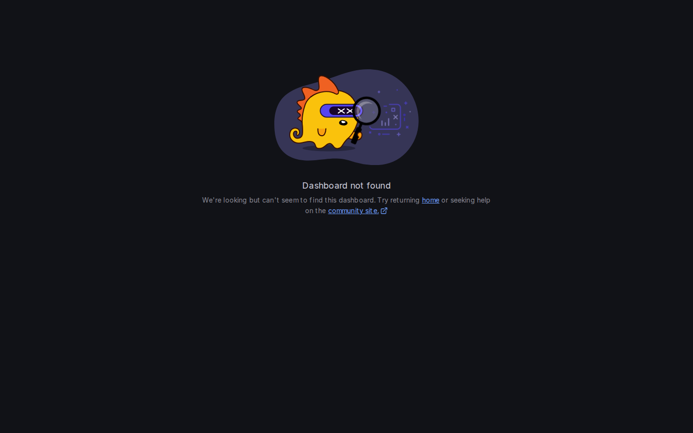

### Grafana — Container Metrics Dashboard (cAdvisor)
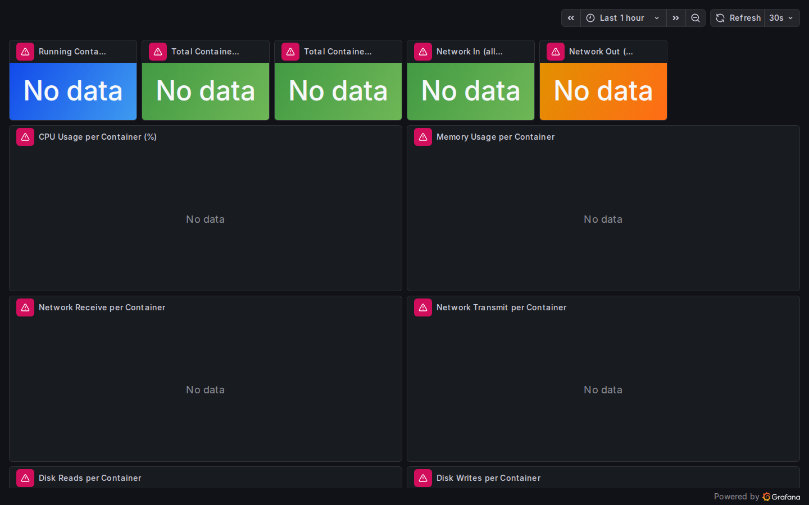

### Grafana — Alert Rules & Log Explorer

| Alert Rules | Loki Log Explorer |
|:-----------:|:-----------------:|
| 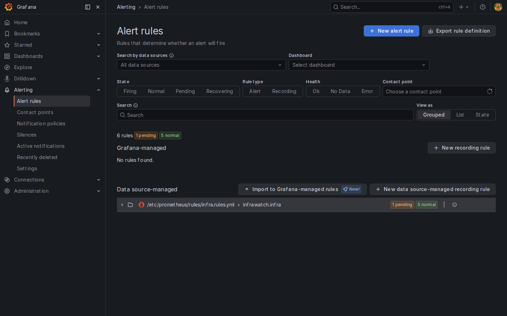 | 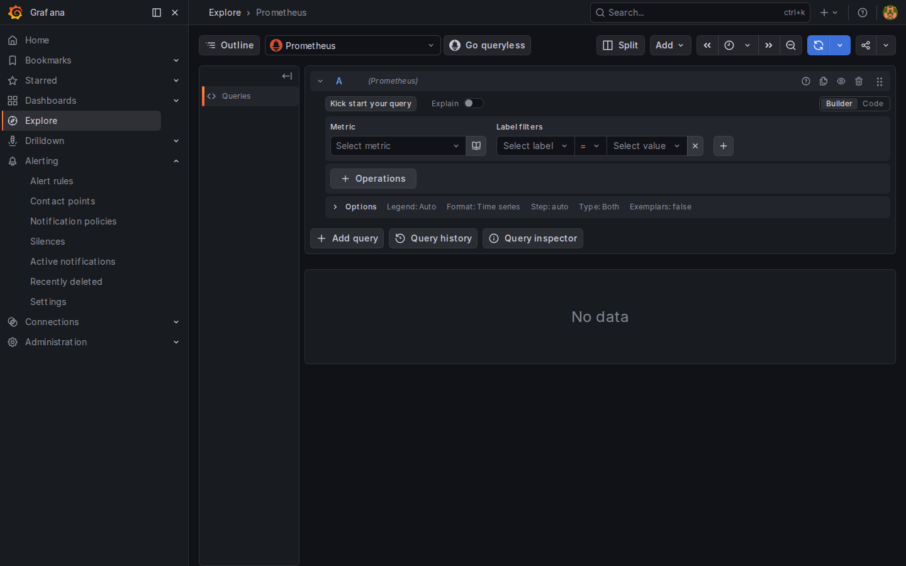 |

### Prometheus — Queries, Targets & Alerts

| Query Graph | CPU PromQL Query |
|:-----------:|:----------------:|
| 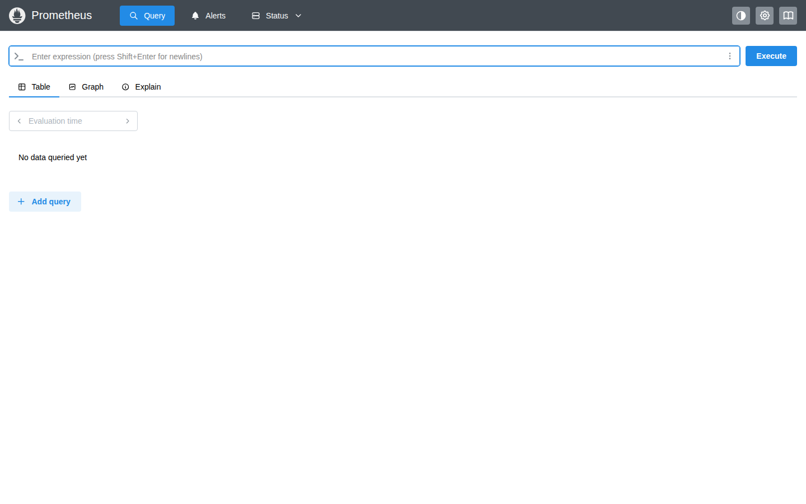 | 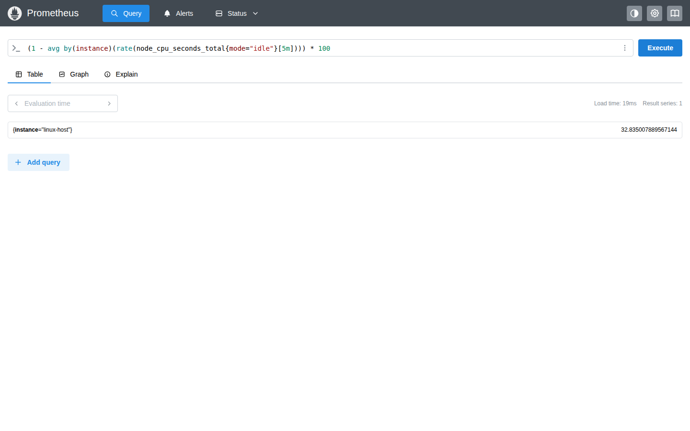 |

| Scrape Targets | Active Alerts |
|:--------------:|:-------------:|
| 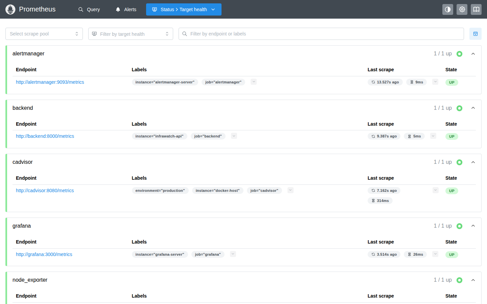 | 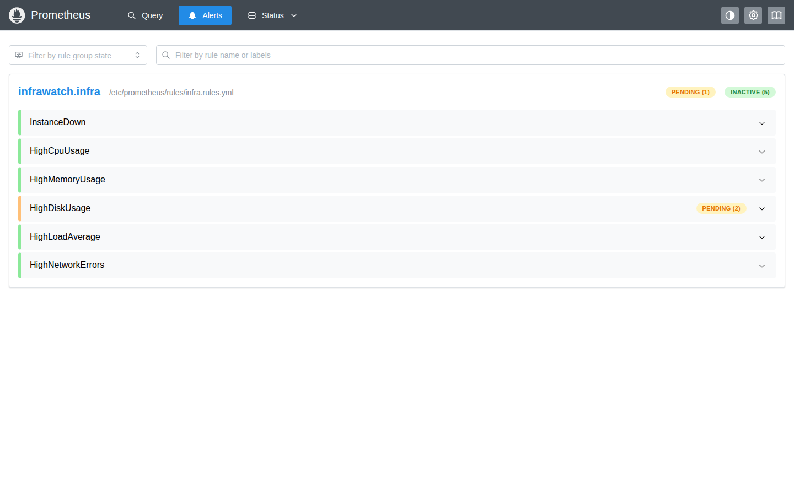 |

### Alertmanager — Alert Routing UI
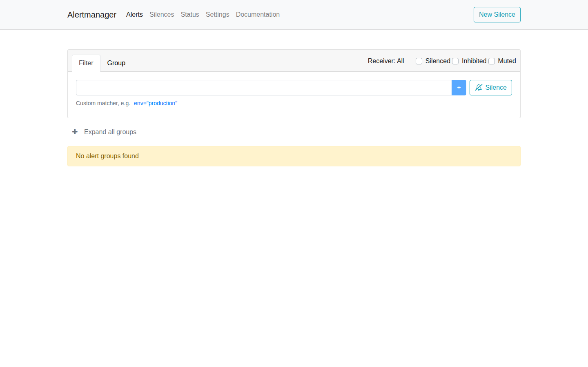

### Backend REST API — FastAPI / Swagger

| Swagger UI | Available Endpoints | Health Check |
|:----------:|:-------------------:|:------------:|
|  | 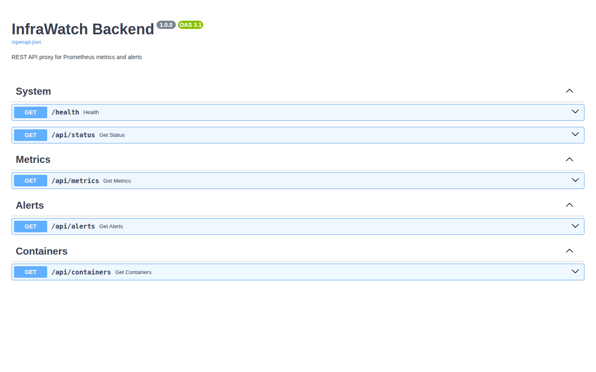 | 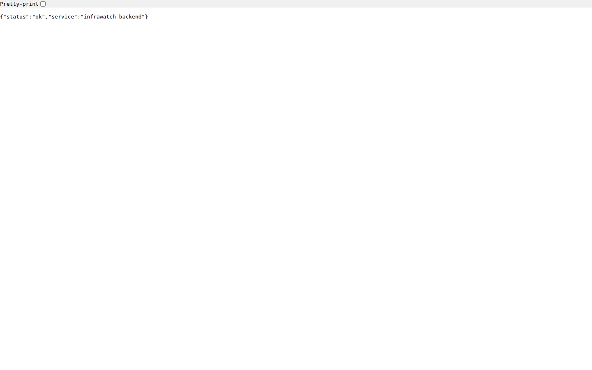 |

### Backend REST API — Haqiqiy JSON javoblar

| /api/metrics | /api/containers |
|:---:|:---:|
| 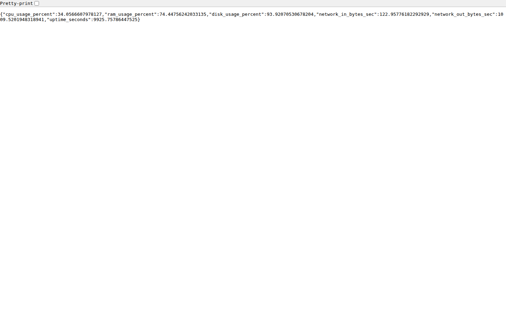 | 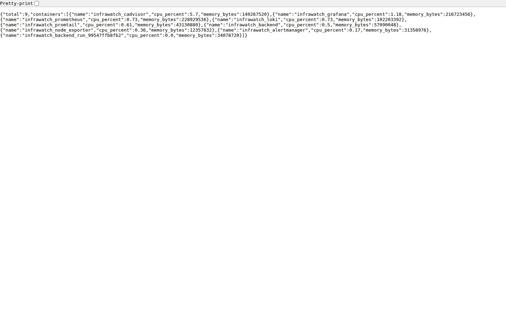 |

### cAdvisor — Per-Container Resource Metrics

| Overview | Detailed View |
|:--------:|:-------------:|
| 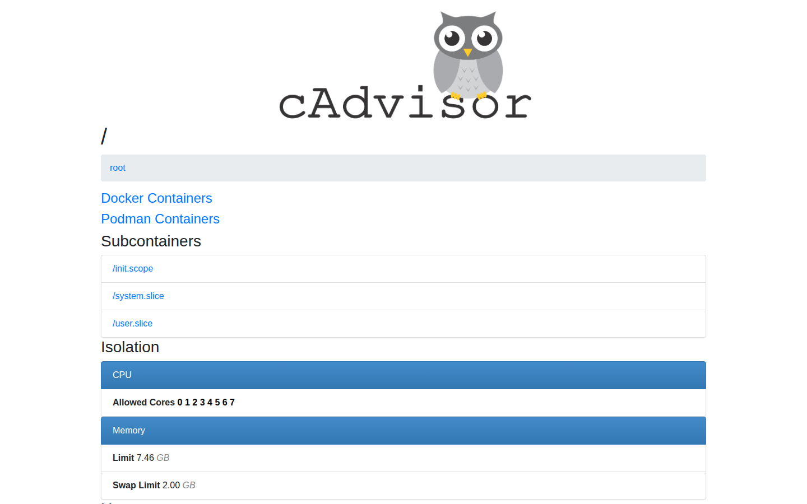 | 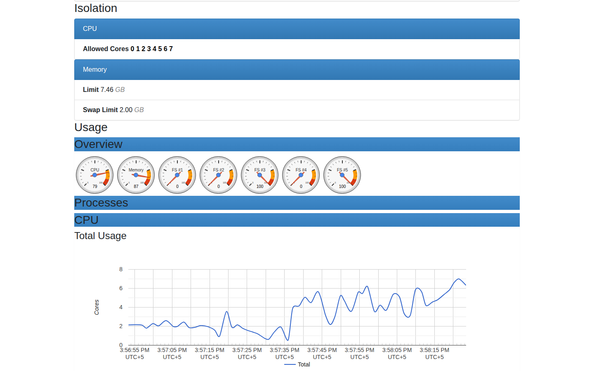 |

<details>
<summary><b>How to capture screenshots</b></summary>

```bash
make up          # start the stack
# wait ~30 seconds, then open:
# Grafana Linux Overview  → http://localhost:3000/d/infrawatch-linux/
# Grafana cAdvisor        → http://localhost:3000/d/infrawatch-cadvisor/
# Grafana Alerts          → http://localhost:3000/alerting/list
# Grafana Explore (Loki)  → http://localhost:3000/explore
# Prometheus Graph        → http://localhost:9090/graph
# Prometheus Targets      → http://localhost:9090/targets
# Alertmanager            → http://localhost:9093
# Backend Swagger         → http://localhost:8000/docs
# cAdvisor                → http://localhost:8080
```

</details>

---

## Table of Contents

- [The 180-Day Challenge](#the-180-day-challenge)
- [Demo Videos](#demo-videos)
- [Screenshots](#screenshots)
- [Architecture](#architecture)
- [Tech Stack](#tech-stack)
- [Features](#features)
- [180-Day Progress](#180-day-progress)
- [Quick Start](#quick-start)
- [Service URLs & Credentials](#service-urls--credentials)
- [Project Structure](#project-structure)
- [Backend REST API](#backend-rest-api)
- [Alerting](#alerting)
- [Log Aggregation](#log-aggregation)
- [Dashboard Panels](#dashboard-panels)
- [Configuration](#configuration)
- [Useful Commands](#useful-commands)
- [Ports Reference](#ports-reference)
- [Troubleshooting](#troubleshooting)
- [Extending InfraWatch](#extending-infrawatch)
- [Portfolio](#portfolio)
- [License](#license)

---

## Architecture

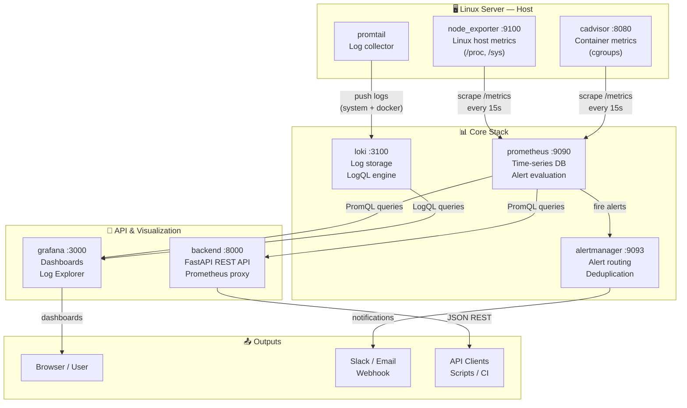

> All 8 containers share an isolated Docker bridge network `monitoring`. No external services required — fully self-hosted.

---

## Tech Stack

| Layer | Technology | Version | Role |
|-------|-----------|---------|------|
| **Metrics DB** | Prometheus | latest | Time-series storage, scraping, alert evaluation |
| **Host Metrics** | Node Exporter | latest | ~1000 Linux host metrics via `/proc`, `/sys` |
| **Container Metrics** | cAdvisor | latest | Per-container CPU, RAM, network, disk I/O |
| **Log Storage** | Loki | latest | Log aggregation + LogQL query engine |
| **Log Collection** | Promtail | latest | Tail `/var/log` and Docker JSON logs → Loki |
| **Alerting** | Alertmanager | latest | Alert routing, deduplication, Slack/email receivers |
| **Dashboards** | Grafana | latest | Metrics + log visualization, auto-provisioned |
| **REST API** | FastAPI | 0.109 | Async Python 3.11 API, proxies Prometheus data |
| **HTTP Client** | HTTPX | 0.27+ | Async Prometheus queries with connection pooling |
| **ASGI Server** | Uvicorn | 0.29 | Production-grade async server |
| **Data Validation** | Pydantic | 2.x | Request/response schema validation |
| **Orchestration** | Docker Compose | v2 | 8-service containerized stack |

**Coming in later phases:** Redis, Celery, PostgreSQL, SQLAlchemy, Alembic, WebSockets, scikit-learn, Kubernetes, Helm

---

## Features

### ✅ Implemented (Days 1–10)

- **~1000 host metrics** — CPU per core, RAM, disk per partition, network I/O, system load, uptime, open file descriptors
- **Pre-built Grafana dashboards** — Linux Server Overview (12 panels) + Container Metrics / cAdvisor (8 panels) — zero config on startup
- **6 pre-built alert rules** — CPU >80%, RAM >85%, disk >90%, high load, network errors, instance down
- **Alert routing** — Alertmanager with inhibition rules (critical suppresses warnings), pluggable Slack/email receivers
- **Log aggregation** — system logs + all Docker container logs, searchable with LogQL in Grafana Explore
- **REST API** — `/api/metrics`, `/api/alerts`, `/api/status`, `/api/containers` as clean JSON endpoints
- **Parallel Prometheus queries** — all metric queries run concurrently via `asyncio.gather`
- **Swagger UI** — interactive API documentation at `/docs`
- **Docker healthchecks** — all 8 services report health via `docker compose ps`
- **Single-command startup** — `make up` or `docker compose up -d`

### 🔜 Planned

| Day | Feature | Description |
|-----|---------|-------------|
| 11 | WebSocket server | Push live metrics to browser without polling |
| 12 | Server-Sent Events | SSE feed for real-time dashboard updates |
| 15 | Real-time dashboard | Vanilla JS/React live metrics UI |
| 20 | Metric range queries | 24h trend lines via Prometheus range API |
| 31 | Celery + Redis | Async distributed task queue |
| 32 | Celery Beat | Periodic task scheduling (cron-style) |
| 35 | Scheduled health checks | Automated infrastructure checks |
| 45 | Auto-remediation | Restart unhealthy containers on alert |
| 50 | Webhook receiver | Handle Alertmanager webhook callbacks |
| 61 | JWT authentication | Token-based API security |
| 65 | RBAC | Admin / operator / viewer role separation |
| 70 | Audit log | Track every action with timestamp + actor |
| 91 | PostgreSQL | Persist alert history and annotations |
| 100 | Alembic | Database migration management |
| 121 | Z-score detection | Statistical anomaly detection on metrics |
| 130 | Predictive alerting | Fire before threshold breach |
| 135 | Isolation Forest | ML-based multivariate anomaly detection |
| 151 | Kubernetes manifests | Deployment + Service + ConfigMap YAMLs |
| 160 | GitHub Actions CI/CD | Automated test + build + deploy pipeline |
| 175 | Prometheus federation | Multi-node metric aggregation |

---

## 180-Day Progress

### Phase 1: Core Observability (Days 1–10) ✅

- [x] **Day 01** — Prometheus + Node Exporter: Linux host metrics collection
- [x] **Day 02** — Grafana: Linux Server Overview dashboard (12 panels)
- [x] **Day 03** — Alertmanager: alert routing with 6 pre-built rules
- [x] **Day 04** — Loki: log aggregation backend
- [x] **Day 05** — Promtail: log collection (system logs + Docker container logs)
- [x] **Day 06** — cAdvisor: per-container CPU / RAM / network / IO metrics
- [x] **Day 07** — FastAPI Backend: REST API (`/api/metrics`, `/api/alerts`, `/api/status`, `/api/containers`)
- [x] **Day 08** — Docker Compose: 8-service orchestration with healthchecks
- [x] **Day 09** — Grafana cAdvisor Dashboard: 8 container metric panels
- [x] **Day 10** — Documentation, screenshots, architecture diagram, Makefile

### Phase 2: Real-time Streaming (Days 11–30) 🔜

- [ ] **Day 11** — WebSocket server: live metric push endpoint
- [ ] **Day 12** — SSE: Server-Sent Events metrics feed
- [ ] **Day 13** — Live dashboard: JS real-time CPU/RAM/disk cards
- [ ] **Day 14** — Range queries: 24h trend charts via Prometheus
- [ ] **Day 15** — Full real-time dashboard page
- [ ] **Day 20** — Multi-metric comparison view
- [ ] **Day 25** — Alert notification panel (WebSocket-driven)
- [ ] **Day 30** — Dashboard polish + mobile responsive layout

### Phase 3: Task Queue & Automation (Days 31–60) 📋

- [ ] **Day 31** — Celery + Redis: async task queue
- [ ] **Day 32** — Celery Beat: periodic scheduling
- [ ] **Day 35** — Scheduled health checks with alerting
- [ ] **Day 40** — Prometheus rule hot-reload automation
- [ ] **Day 45** — Auto-remediation: restart containers on alert
- [ ] **Day 50** — Webhook receiver for Alertmanager
- [ ] **Day 55** — Self-healing runbooks
- [ ] **Day 60** — Task result dashboard in Grafana

### Phase 4: Security & RBAC (Days 61–90) 📋

- [ ] **Day 61** — JWT authentication for API endpoints
- [ ] **Day 65** — RBAC: admin / operator / viewer roles
- [ ] **Day 70** — Audit logging: action trail with timestamps
- [ ] **Day 75** — Rate limiting and API key management
- [ ] **Day 80** — NGINX TLS termination proxy
- [ ] **Day 85** — Secret management (Docker secrets / Vault)
- [ ] **Day 90** — Security hardening review

### Phase 5: Database & Persistence (Days 91–120) 📋

- [ ] **Day 91** — PostgreSQL: primary database
- [ ] **Day 95** — SQLAlchemy ORM models
- [ ] **Day 100** — Alembic migration system
- [ ] **Day 105** — Alert history persistence and query API
- [ ] **Day 110** — Analytics: trend summaries and reports
- [ ] **Day 115** — Annotation storage for Grafana
- [ ] **Day 120** — Data export (CSV, JSON) endpoints

### Phase 6: ML & Anomaly Detection (Days 121–150) 📋

- [ ] **Day 121** — Z-score baseline anomaly detection
- [ ] **Day 125** — IQR-based outlier detection
- [ ] **Day 130** — Predictive alerting: fire before breach
- [ ] **Day 135** — Isolation Forest for multivariate anomalies
- [ ] **Day 140** — Model training pipeline on Prometheus data
- [ ] **Day 145** — Anomaly annotations in Grafana
- [ ] **Day 150** — Anomaly scoring dashboard

### Phase 7: Production Hardening (Days 151–180) 📋

- [ ] **Day 151** — Kubernetes Deployment + Service manifests
- [ ] **Day 155** — Helm chart
- [ ] **Day 160** — GitHub Actions CI/CD pipeline
- [ ] **Day 165** — Multi-node Prometheus federation
- [ ] **Day 170** — Thanos for long-term S3-backed storage
- [ ] **Day 175** — Runbook automation framework
- [ ] **Day 180** — Final production deployment + post-mortem

---

## Quick Start

### Prerequisites

| Tool | Minimum Version | Check command |
|------|----------------|---------------|
| Docker | 20.x | `docker --version` |
| Docker Compose | v2 | `docker compose version` |
| Make | any | `make --version` *(optional)* |

**Install Docker on Ubuntu:**
```bash
sudo apt-get update && sudo apt-get install -y docker.io docker-compose-plugin
sudo usermod -aG docker $USER && newgrp docker
```

### Run the stack

```bash
# 1. Clone
git clone https://github.com/builtbysardor/infrawatch.git
cd infrawatch

# 2. (Optional) edit credentials
nano .env

# 3. Start all 8 services
make up
# or: docker compose up -d

# 4. Wait ~30 seconds, then open:
#    Grafana    → http://localhost:3000  (admin / infrawatch)
#    API Docs   → http://localhost:8000/docs
#    Prometheus → http://localhost:9090
#    Alerts     → http://localhost:9093
```

### Verify all services are healthy

```bash
make status
# or: docker compose ps
```

Expected output:
```
NAME                        STATUS        PORTS
infrawatch_alertmanager     Up (healthy)  0.0.0.0:9093->9093/tcp
infrawatch_backend          Up (healthy)  0.0.0.0:8000->8000/tcp
infrawatch_cadvisor         Up            0.0.0.0:8080->8080/tcp
infrawatch_grafana          Up (healthy)  0.0.0.0:3000->3000/tcp
infrawatch_loki             Up (healthy)  0.0.0.0:3100->3100/tcp
infrawatch_node_exporter    Up (healthy)  0.0.0.0:9100->9100/tcp
infrawatch_prometheus       Up (healthy)  0.0.0.0:9090->9090/tcp
infrawatch_promtail         Up
```

---

## Service URLs & Credentials

| Service | URL | Credentials |
|---------|-----|-------------|
| **Grafana** | http://localhost:3000 | admin / infrawatch |
| **Prometheus** | http://localhost:9090 | — |
| **Alertmanager** | http://localhost:9093 | — |
| **Backend API** | http://localhost:8000/docs | — |
| **cAdvisor** | http://localhost:8080 | — |
| **Node Exporter** | http://localhost:9100/metrics | — |
| **Loki** | http://localhost:3100 | — |

> Change default credentials in `.env` before exposing to a network.

---

## Project Structure

```
infrawatch/
├── docker-compose.yml                   # All 8 services defined here
├── .env                                 # Credentials and config (edit this)
├── Makefile                             # Convenience commands (make up, make logs…)
│
├── prometheus/
│   ├── prometheus.yml                   # Scrape targets + alerting config
│   └── rules/
│       └── infra.rules.yml              # Alert rules: CPU, RAM, Disk, Down
│
├── alertmanager/
│   └── alertmanager.yml                 # Alert routing and receivers
│
├── grafana/
│   ├── provisioning/
│   │   ├── datasources/
│   │   │   ├── prometheus.yml           # Auto-registers Prometheus datasource
│   │   │   └── loki.yml                 # Auto-registers Loki datasource
│   │   └── dashboards/
│   │       └── default.yml              # Tells Grafana where to find dashboards
│   └── dashboards/
│       ├── linux-overview.json          # Pre-built Linux host monitoring dashboard
│       └── cadvisor-containers.json     # Per-container CPU/RAM/net/IO dashboard
│
├── loki/
│   └── loki-config.yml                  # Loki storage and schema config
│
├── promtail/
│   └── promtail-config.yml              # Log scraping jobs (system + docker)
│
├── backend/
│   ├── main.py                          # FastAPI application (5 endpoints)
│   ├── requirements.txt                 # fastapi, uvicorn, httpx, pydantic
│   └── Dockerfile                       # python:3.11-slim image
│
└── screenshots/                         # UI screenshots (01–16)
```

---

## Backend REST API

The FastAPI backend (`http://localhost:8000`) provides clean JSON over Prometheus data.

### Endpoints

#### `GET /health`
Liveness check. Returns `200 OK` if the service is running.
```json
{ "status": "ok", "service": "infrawatch-backend" }
```

#### `GET /api/metrics`
Current system metrics snapshot — 6 Prometheus queries run in parallel.
```json
{
  "cpu_usage_percent": 12.4,
  "ram_usage_percent": 58.7,
  "disk_usage_percent": 34.1,
  "network_in_bytes_sec": 1024.5,
  "network_out_bytes_sec": 512.3,
  "uptime_seconds": 86400.0
}
```

#### `GET /api/alerts`
All active Prometheus alerts (firing and pending).
```json
{
  "total": 1,
  "firing": 1,
  "pending": 0,
  "alerts": [
    {
      "labels": { "alertname": "HighCpuUsage", "severity": "warning" },
      "annotations": { "summary": "High CPU usage on linux-host" },
      "state": "firing",
      "activeAt": "2026-05-15T10:00:00Z",
      "value": "85.3"
    }
  ]
}
```

#### `GET /api/status`
Stack health — Prometheus reachability and all scrape target states.
```json
{
  "prometheus_reachable": true,
  "targets": [
    { "job": "node_exporter", "instance": "linux-host", "up": true },
    { "job": "cadvisor", "instance": "docker-host", "up": true }
  ]
}
```

#### `GET /api/containers`
Per-container CPU and memory from cAdvisor metrics, sorted by CPU usage.
```json
{
  "total": 8,
  "containers": [
    { "name": "infrawatch_grafana",    "cpu_percent": 3.12, "memory_bytes": 104857600 },
    { "name": "infrawatch_prometheus", "cpu_percent": 1.84, "memory_bytes": 67108864 }
  ]
}
```

> Full interactive docs with try-it-out: **http://localhost:8000/docs**

---

## Alerting

InfraWatch ships with 6 pre-built alert rules in `prometheus/rules/infra.rules.yml`.

### Alert rules

| Alert | Condition | Duration | Severity |
|-------|-----------|----------|----------|
| `InstanceDown` | Target unreachable | 1 min | critical |
| `HighCpuUsage` | CPU > 80% | 5 min | warning |
| `HighMemoryUsage` | RAM > 85% | 5 min | warning |
| `HighDiskUsage` | Disk > 90% | 5 min | critical |
| `HighLoadAverage` | Load > 85% of CPU count | 5 min | warning |
| `HighNetworkErrors` | >10 errors/sec | 2 min | warning |

### How alerts flow

```
Prometheus evaluates rules every 15s
  → condition true for "for:" duration
    → alert: inactive → pending → firing
      → Prometheus POSTs to Alertmanager (port 9093)
        → Alertmanager groups, deduplicates, applies inhibitions
          → routes to receiver (email / Slack / webhook)
```

### Enable Slack notifications

Edit `alertmanager/alertmanager.yml` and uncomment the `slack_configs` block:

```yaml
receivers:
  - name: "critical-alerts"
    slack_configs:
      - api_url: "https://hooks.slack.com/services/YOUR/WEBHOOK/URL"
        channel: "#alerts"
        title: '[{{ .Status | toUpper }}] {{ .CommonLabels.alertname }}'
        text: '{{ range .Alerts }}{{ .Annotations.description }}{{ end }}'
        send_resolved: true
```

Then reload:
```bash
docker compose restart alertmanager
```

### Enable email notifications

```yaml
receivers:
  - name: "default"
    email_configs:
      - to: "your@email.com"
        from: "alerts@infrawatch.local"
        smarthost: "smtp.gmail.com:587"
        auth_username: "your@gmail.com"
        auth_password: "your-app-password"
        send_resolved: true
```

---

## Log Aggregation

Promtail collects two log streams and ships them to Loki:

| Stream | Source | Labels |
|--------|--------|--------|
| System logs | `/var/log/*.log` | `job=varlogs` |
| Container logs | `/var/lib/docker/containers/*/*-json.log` | `job=docker`, `stream=stdout/stderr` |

### Viewing logs in Grafana

1. Open **http://localhost:3000**
2. Click **Explore** (compass icon)
3. Select **Loki** as data source
4. Run LogQL:

```logql
# All system logs
{job="varlogs"}

# Only error lines
{job="varlogs"} |= "error"

# Logs from a specific container
{job="docker"} |= "prometheus"

# All sources
{job=~"varlogs|docker"}
```

---

## Dashboard Panels

Two dashboards are provisioned automatically on first startup.

### InfraWatch — Linux Server Overview

| Panel | Type | Description |
|-------|------|-------------|
| System Uptime | Stat | Server uptime in human-readable format |
| CPU Usage % | Stat + threshold | Current load with red/yellow/green coloring |
| RAM Usage % | Stat + threshold | Memory utilization percentage |
| Disk Usage % | Stat | Root partition usage |
| Network In | Stat | Inbound bytes per second |
| Network Out | Stat | Outbound bytes per second |
| CPU Over Time | Time Series | Per-core CPU history |
| RAM Over Time | Time Series | Used / Available / Total RAM |
| Network Traffic | Time Series | Inbound and outbound over time |
| Disk by Partition | Bar Gauge | Usage % for all mounted filesystems |
| Disk I/O | Time Series | Read and write throughput |
| Load Average | Time Series | 1m / 5m / 15m system load |

### InfraWatch — Container Metrics (cAdvisor)

| Panel | Type | Description |
|-------|------|-------------|
| Running Containers | Stat | Total count of running containers |
| Total CPU Cores | Stat | Logical CPU count on the host |
| Total Memory | Stat | Host RAM available to containers |
| CPU Usage per Container | Time Series | CPU % per container over time |
| Memory Usage per Container | Time Series | RAM usage per container |
| Network Rx per Container | Time Series | Inbound bytes per second |
| Network Tx per Container | Time Series | Outbound bytes per second |
| Filesystem Usage | Bar Gauge | Disk usage % per container |

---

## Configuration

All configurable values are in `.env`:

```env
# Grafana admin credentials
GRAFANA_ADMIN_USER=admin
GRAFANA_ADMIN_PASSWORD=infrawatch

# Prometheus data retention
PROMETHEUS_RETENTION=15d
```

Apply changes:
```bash
docker compose up -d grafana        # apply Grafana credential changes
docker compose up -d prometheus     # apply retention changes
```

---

## Useful Commands

```bash
# ── Stack lifecycle ──────────────────────────────────────────
make up                              # start everything in background
make down                            # stop everything
make restart                         # restart all services
make build                           # rebuild backend image after code changes
make clean                           # stop + delete all data volumes (irreversible)

# ── Monitoring ───────────────────────────────────────────────
make logs                            # follow logs from all containers
make status                          # show container status and health
make reload-prometheus               # hot-reload Prometheus config without restart

# ── Per-service ───────────────────────────────────────────────
docker compose logs -f grafana       # logs for a specific service
docker compose restart prometheus    # restart one service
docker stats                         # live container resource usage

# ── Inspect raw data ─────────────────────────────────────────
curl http://localhost:9100/metrics | head -30    # raw Node Exporter output
curl http://localhost:8000/api/metrics           # backend metrics summary
curl http://localhost:8000/api/alerts            # active alerts as JSON
curl http://localhost:8000/api/containers        # per-container CPU/RAM
```

---

## Ports Reference

| Service | Host Port | URL |
|---------|-----------|-----|
| Grafana | 3000 | http://localhost:3000 |
| Prometheus | 9090 | http://localhost:9090 |
| Alertmanager | 9093 | http://localhost:9093 |
| Backend API | 8000 | http://localhost:8000/docs |
| Loki | 3100 | http://localhost:3100 |
| cAdvisor | 8080 | http://localhost:8080 |
| Node Exporter | 9100 | http://localhost:9100/metrics |

---

## Troubleshooting

### Grafana shows "No data" on the dashboard
- Wait 1–2 minutes after startup for the first Prometheus scrape cycle
- Check targets: http://localhost:9090/targets — all should show **UP**
- If a target is DOWN: `docker compose logs node_exporter`

### Backend API returns 503
- Prometheus is not ready yet — wait 20–30 seconds after `make up`
- Check: `docker compose logs backend`

### Loki not receiving logs
- Verify Promtail started: `docker compose logs promtail`
- Make sure `/var/log` is readable by the container (mounted `:ro`)
- Check Promtail positions: `docker compose logs promtail | grep "read"` 

### Cannot access any service on a remote server
```bash
sudo ufw allow 3000/tcp   # Grafana
sudo ufw allow 9090/tcp   # Prometheus
sudo ufw allow 9093/tcp   # Alertmanager
sudo ufw allow 8000/tcp   # Backend API
```

### Containers keep restarting
```bash
docker compose ps                        # find which service is unhealthy
docker compose logs <service-name>       # read its error output
```

### "Permission denied" on Docker commands
```bash
sudo usermod -aG docker $USER && newgrp docker
```

### cAdvisor fails to start
The `/dev/kmsg` device may not exist on all kernels. If so, comment out in `docker-compose.yml`:
```yaml
# devices:
#   - /dev/kmsg:/dev/kmsg
```

---

## Extending InfraWatch

### Add Prometheus scrape targets

Edit `prometheus/prometheus.yml` and add a new job, then run `make reload-prometheus`:

```yaml
- job_name: "mysql"
  static_configs:
    - targets: ["mysql_exporter:9104"]
```

Popular exporters: `mysql_exporter`, `redis_exporter`, `nginx-prometheus-exporter`, `blackbox_exporter`, `postgres_exporter`

### Add custom alert rules

Add a `.rules.yml` file under `prometheus/rules/` — Prometheus loads all matching files automatically.

### Enable Slack / email alerts

See the [Alerting](#alerting) section above.

---

## Portfolio

InfraWatch is part of a public 180-day engineering challenge. Each commit represents one day of real infrastructure engineering work.

| | |
|--|--|
| **GitHub** | [github.com/builtbysardor/infrawatch](https://github.com/builtbysardor/infrawatch) |
| **Presentation** | [infrawatch-presentation.pdf](presentation/infrawatch-presentation.pdf) |
| **Author** | [builtbysardor](https://github.com/builtbysardor) |
| **Challenge started** | May 2026 |
| **Goal** | 180 production-grade infrastructure components in 180 days |

> If you're a recruiter or engineer reviewing this: every feature is production-intentioned. The goal is to demonstrate real DevOps and backend engineering depth — not toy examples.

**Skills demonstrated so far:**
- Container orchestration (Docker Compose, health checks, networking)
- Observability stack design (metrics, logs, alerting — the three pillars)
- API design (async FastAPI, parallel queries, proper error handling)
- Infrastructure as Code (declarative configs, auto-provisioning, `make`-based workflows)
- PromQL and LogQL query authoring
- Production alerting patterns (inhibition rules, grouping, routing)

---

## License

MIT License — free to use, modify, and distribute.

---

*Built by [builtbysardor](https://github.com/builtbysardor) — one infrastructure component per day, 180 days.*
